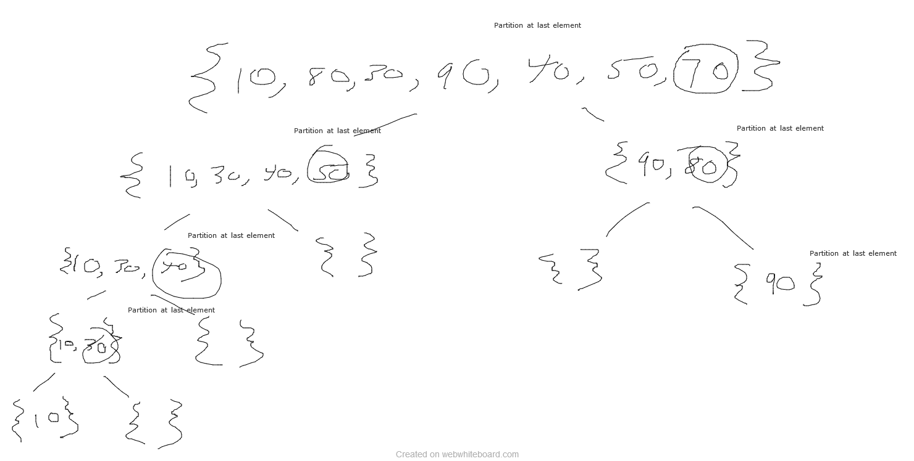

 # Insertion Sort

## Problem Domain

Insert value into array and sort into ascending order.  

## Pseudocode

    InsertionSort(int[] arr)
  
    FOR i = 1 to arr.length
    
      int j <-- i - 1
      int temp <-- arr[i]
      
      WHILE j >= 0 AND temp < arr[j]
        arr[j + 1] <-- arr[j]
        j <-- j - 1
        
      arr[j + 1] <-- temp

## Examples

[8,4,23,42,16,15] - > [4,8,15,16,23,42]

Reverse-sorted: [20,18,12,8,5,-2] - > [-2,5,8,12,18,20]

Few uniques: [5,12,7,5,5,7] - > [5,5,5,7,7,12]

Nearly-sorted: [2,3,5,7,13,11] - > [2,3,5,7,11,13]

 # MergeSort

## Problem Domain

Divides input array in two halves, calls itself for the two halves and then merges the two sorted halves

## Pseudocode

    
    ALGORITHM Mergesort(arr)
    DECLARE n <-- arr.length
           
    if n > 1
      DECLARE mid <-- n/2
      DECLARE left <-- arr[0...mid]
      DECLARE right <-- arr[mid...n]
      // sort the left side
      Mergesort(left)
      // sort the right side
      Mergesort(right)
      // merge the sorted left and right sides together
      Merge(left, right, arr)

    ALGORITHM Merge(left, right, arr)
    DECLARE i <-- 0
    DECLARE j <-- 0
    DECLARE k <-- 0

    while i < left.length && j < right.length
        if left[i] <= right[j]
            arr[k] <-- left[i]
            i <-- i + 1
        else
            arr[k] <-- right[j]
            j <-- j + 1
            
        k <-- k + 1

    if i = left.length
       set remaining entries in arr to remaining values in right
    else
       set remaining entries in arr to remaining values in left

## Examples

https://www.geeksforgeeks.org/merge-sort/

# Quick Sort

## Problem Domain

Quicksort is an algorithm used to quickly sort items within an array no matter how big the array is. It is quite scalable and works relatively well for small and large data sets, and is easy to implement with little time complexity. It does this through a divide-and-conquer method that divides a single large array into two smaller ones and then repeats this process for all created arrays until the sort is complete. This code specifically targets the last value in the array and partitions based on its value.

## Pseudocode

    ALGORITHM QuickSort(arr, left, right)
        if left < right
            // Partition the array by setting the position of the pivot value 
            DEFINE position <-- Partition(arr, left, right)
            // Sort the left
            QuickSort(arr, left, position - 1)
            // Sort the right
            QuickSort(arr, position + 1, right)
    
    ALGORITHM Partition(arr, left, right)
        // set a pivot value as a point of reference
        DEFINE pivot <-- arr[right]
        // create a variable to track the largest index of numbers lower than the defined pivot
        DEFINE low <-- left - 1
        for i <- left to right do
            if arr[i] <= pivot
                low++
                Swap(arr, i, low)
    
         // place the value of the pivot location in the middle.
         // all numbers smaller than the pivot are on the left, larger on the right. 
         Swap(arr, right, low + 1)
        // return the pivot index point
         return low + 1
    
    ALGORITHM Swap(arr, i, low)
        DEFINE temp;
        temp <-- arr[i]
        arr[i] <-- arr[low]
        arr[low] <-- temp

## Examples

# Hashtable

## Challenge
Implement a Hashtable with the following methods:

    add: takes in both the key and value. This method should hash the key, and add the key and value pair to the table, handling collisions as needed.
    get: takes in the key and returns the value from the table.
    contains: takes in the key and returns a boolean, indicating if the key exists in the table already.
    hash: takes in an arbitrary key and returns an index in the collection.

### Approach & Efficiency
##### time:
- hash() : O(n)
- add() : O(1)
- get() : O(1)
- contains() : O(1)
- hashHelperMethod() : O(n)

##### space: 
- hash() : O(1)
- add() : O(1)
- get() : O(1)
- contains() : O(1)
- hashHelperMethod() : O(n)

